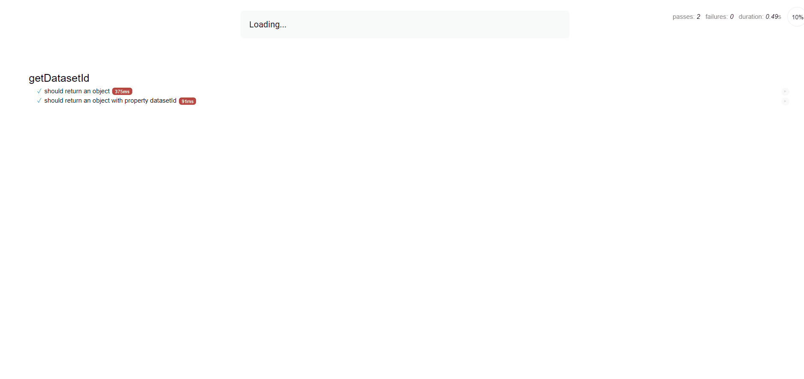

# Coding Exercise - Cox Automotive

Coding exercise for SW Engineer role with Cox Automotive / Kelley Blue Book

## Technologies Used

  - HTML5
  - CSS3
  - JavaScript (ES6)
  - Mocha.js
  - Chai.js

  ## Features
 1. User can view the response from the API post route
 1. User can click "Again!" to grab a new datasetId and run the app again
 1. User can view the test results of each function that interacts with the API

## Preview
 

 ## Development

 ### Getting Started
 1. Clone the repository
    ``` bash
    git clone https://github.com/kusholhuq/coding-exercise-cox.git
    cd coding-exercise-cox
    ```
 1. Open index.html and run with live server (Optional: see VScode extension Live Server by Ritwick Dey.)
